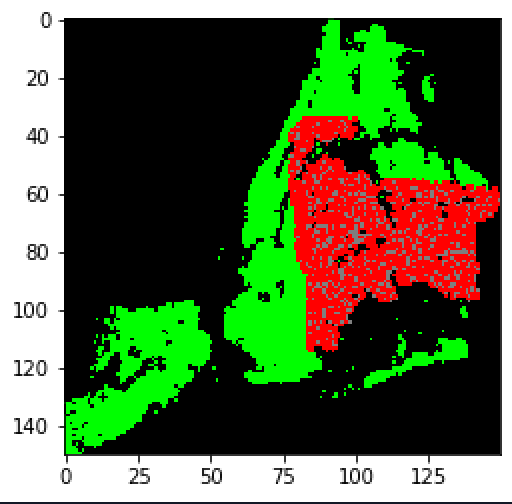

# epidemiology-model-prj

This model simulates the spread of the disease on a map of New York City. Our map is a 150x150 grid.
The model is based on the so-called SRI model. At any time step, each cell on the map can be in one of three states: 

S (susceptible): The cell is healthy and not infected. Displayed green on the map. 
R (resistant): The cell cannot be infected (in our case, that means the cell is dead). Displayed gray on the map. 
I (infected): The cell is currently infected. Displayed red on the map. 

When a cell is infected, it has the potential to infect neighboring cells, it might recover after a certain time (revert to state S), or it might die (move to state R).  Initially all cells will be susceptible and only one cell will be infected. The details about how and when these changes occur are described below. 

Time is measured in discrete steps. After a number of steps, the disease will have spread and infected a number of cells. Some may have recovered and others may have died. The map might look something like this: 

